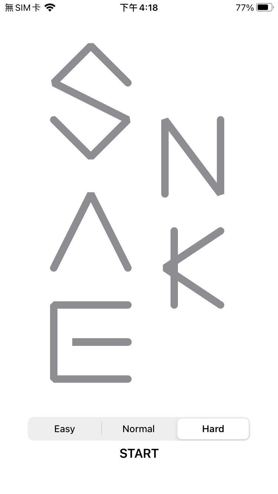
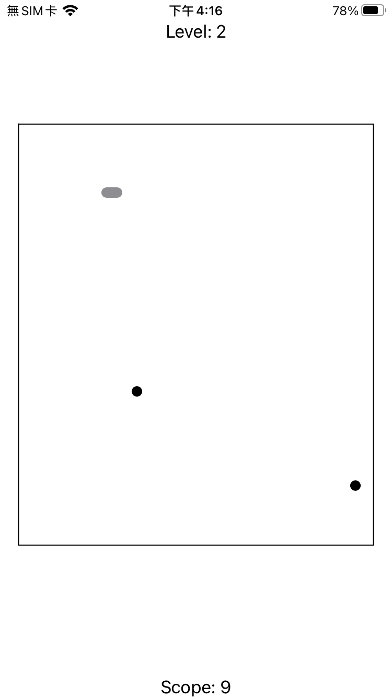
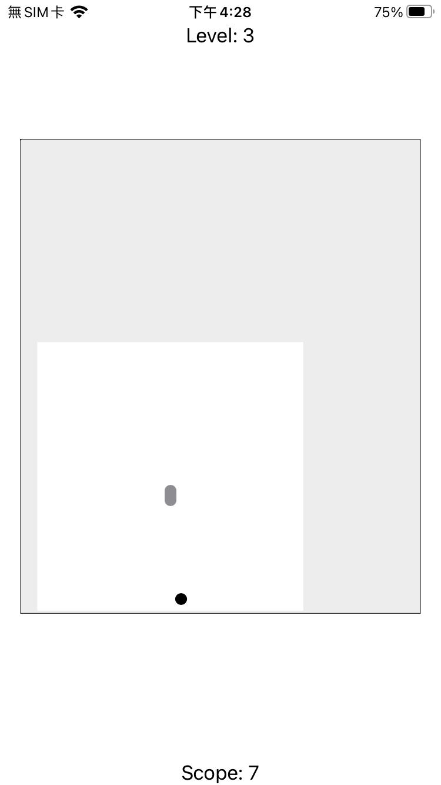
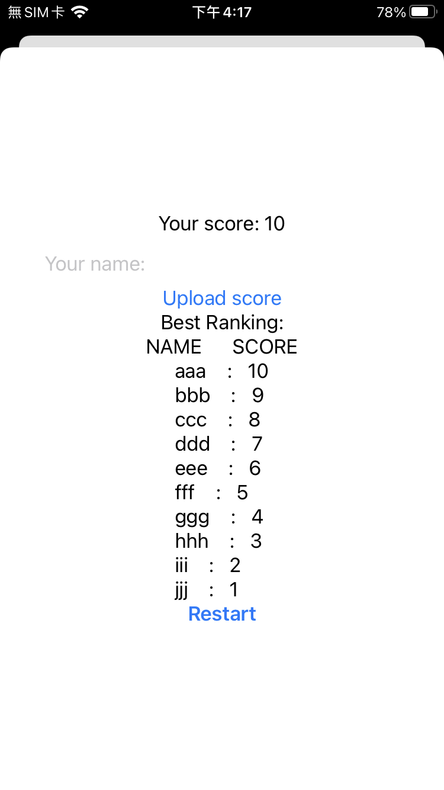

#  BakuSnake－貪食蛇

## 這個小遊戲使用 MVVM 架構

Model:
- 蛇Snake：
  - property 包括：
    - 蛇目前的行進方向，型別是自己設計的Enum，定義上下左右四個方向
    - 蛇目前的身體每個轉折的座標點array，array的first是蛇的尾巴、last是蛇的頭，座標點是tuple(x, y)，內容都是 Int
    - 每段身體的行進方向array，用於計算身體的每個座標點
    - 身體總長度，型別UInt
  - method 包括：
    - 初始化時輸入畫面的最大座標maxX, maxY
    - 要求蛇換方向
    - 要求蛇增加長度
    - 要求蛇移動一格
    - 詢問蛇現在頭是否碰到自己的身體
    - 詢問蛇的頭是否剛好碰到某個點
    - 詢問蛇的身體是否在某個點上
- 食物Foods：
  - 僅有property：
    - 一個座標x, y，型別Int
    - 代表此食物是否是真的，型別Bool  
  - init時輸入畫面的最大座標maxX, maxY，會隨機生成座標點

View:
- 負責在畫面中使用 SwiftUI 繪製蛇與食物
- 上面被加上了 Gesture的判斷，當發生 Swipe 時，會通知ViewModel改變蛇的方向
- 執行一個 Timer，每執行一次，會要求通知ViewModel的蛇移動一格，並重繪一次蛇與食物。

ViewModel:
- 擁有蛇與食物的 Model
- 負責計算蛇身體的每個座標點
- 當 View 要重繪時，都會跟 ViewModel 索取一次蛇與食物的座標點
- 負責蛇的移動，並且檢查蛇是否撞到了水果或自己的身體，決定是要延長蛇的身體，或是宣布遊戲結束

## 遊戲畫面
進入App會有標題，下方可以選擇等級，分為Easy, Normal, Hard三種，按下START開始遊戲

Easy是最普通的貪食蛇
Normal模式會出現兩個以上的食物，但是只有一個是真的

Hard難度則是會有戰爭迷霧，遊戲中只會繪製蛇附近的畫面

最後遊戲結束後會出現所有玩家的排名

若本局得分可以排入前十就會出現Update

